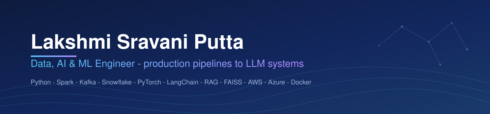

# Hi, I'm Sravani 👋

**Product Specialist / Healthcare Data Analyst — 8+ years keeping healthcare and public-health data systems accurate and reliable.**

I work at the seam between business teams and engineering: SQL-based data analysis and validation, application testing (functional, regression, UAT), production support, and the operational reporting that healthcare programs run on. Currently supporting New York State Department of Health systems; previously CDPH, Change Healthcare, National Health Authority (India), and TCS.

## What I work with
- **SQL:** Oracle SQL, PL/SQL, SQL Server — joins, subqueries, aggregation, reconciliation and data-quality queries
- **Data quality:** validation, profiling, cleansing, reconciliation, root cause analysis, audit checks
- **Testing & QA:** functional / regression / integration / UAT, defect lifecycle, JIRA, ServiceNow, HP ALM/QC
- **Reporting:** operational and ad-hoc reports, MIS reporting, dashboard support, Excel
- **Domain:** healthcare claims and transactions, public-health programs, regulatory/compliance data
- **Python:** learning in public, one exercise a day → [python-daily](https://github.com/sravanni369/python-daily)

## On this profile
- [python-daily](https://github.com/sravanni369/python-daily) — one focused, runnable Python exercise per day: data-quality checks, SQL via sqlite3, log parsing, text chunking, PyTorch basics
- [sms-spam-detection](https://github.com/sravanni369/sms-spam-detection), [plagiarism-checker](https://github.com/sravanni369/plagiarism-checker), [pdf-image-ocr-reader](https://github.com/sravanni369/pdf-image-ocr-reader) — small Python learning projects

## Reach me
📧 sravannicareerv@gmail.com · [LinkedIn](https://linkedin.com/in/sravani-p-212899272)
